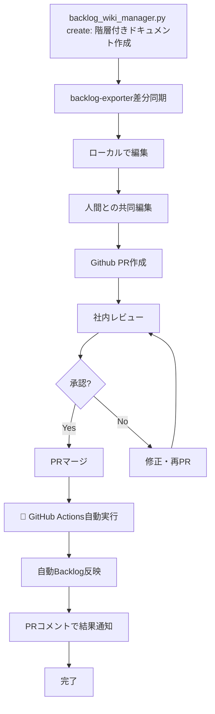
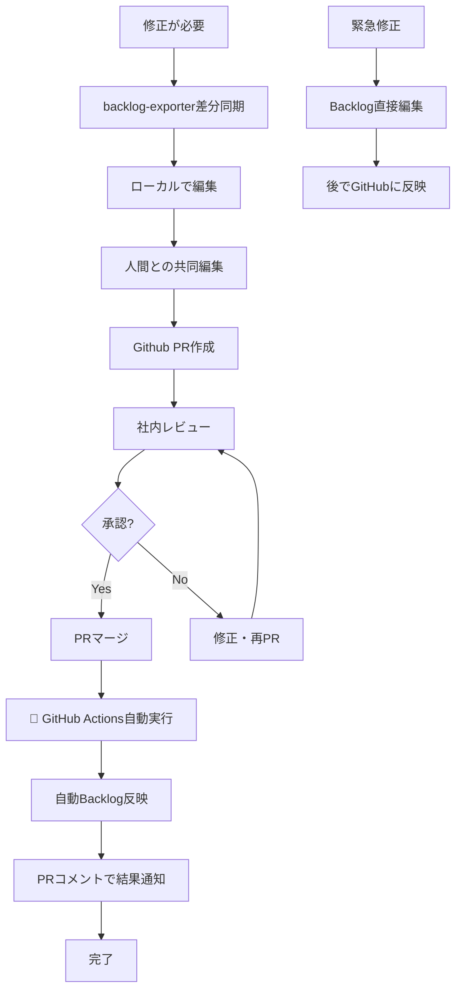

# ドキュメント管理運用ルール（GitHub Actions自動化版）

**目的**: [CLIENT_NAME]マルチアカウント支援プロジェクトにおけるドキュメント管理の統一運用と完全自動化

---

## 基本原則

### データ管理ルール

**マスターデータ**: GitHub（全ての編集はここで実施）
**パブリッシュ先**: Backlog（顧客連携・表示専用）

**編集制限**: 
- **Backlogでの直接編集は原則禁止**（緊急時のみ例外）
- **全ての編集はGitHub経由**でBacklogに反映
- **同時編集禁止**（複数プラットフォームでの同時編集は禁止）

### ツール使い分け戦略

| 操作 | ツール | 理由 | 実行時間 | 使用場面 |
|------|-------|------|----------|----------|
| **全体同期** | backlog-exporter | 差分同期で高速 | 数秒 | 日常的な最新化 |
| **自動Backlog反映** | GitHub Actions | PRマージ時に自動実行 | 30秒〜1分 | **全ての編集操作（推奨）** |
| **手動Wiki操作** | backlog_wiki_manager.py | 階層指定・フルCRUD・統一ツール | 数秒 | 自動化失敗時のフォールバック |
| **緊急対応** | Backlog直接編集 | 最速 | 数分 | 緊急時のみ例外 |

---

## ワークフロー（GitHub Actions完全自動化版）

### 新規ドキュメント作成



### 既存ドキュメント修正



## 詳細手順

### 新規ドキュメント作成手順（自動化版）

**Step 1: Backlogで階層付きドキュメント作成**
```bash
# backlog_wiki_manager.pyで階層指定作成
python3 scripts/backlog_wiki_manager.py create [PROJECT_ID] \
  "[PROJECT_FOLDER]/[CURRENT_PHASE]/02_詳細設計/○○設計書" \
  test_content.md

# 重要: ページ名にスラッシュ（/）を含めることで階層構造を指定
# 例: "フォルダ名/サブフォルダ名/ページ名"
```

**Step 2: 差分同期とローカル編集**
```bash
# 差分同期（数秒で完了）
cd wiki
BACKLOG_API_KEY=$(grep BACKLOG_API_KEY ../.env | cut -d= -f2) backlog-exporter update --force

# ローカルで編集・PR作成
cd ..
git checkout -b feature/new-design-doc
```

**Step 2.5: 人間との共同編集（必須ステップ）**
- **目的**: ドキュメントの品質向上と人間の視点での確認
- **実施内容**:
  - Claude Codeが初版を作成後、必ず人間に内容確認を依頼
  - 表現の調整、業務観点での修正提案を求める
  - 「他にも修正したい箇所はありますか？」の確認を必須とする
- **完了条件**: 人間からの明確な「OK」または「このまま進めて」の確認

```bash
# 人間との共同編集完了後にコミット・PR作成
git add wiki/○○設計書.md
git commit -m "新規作成: ○○設計書"
gh pr create --title "【レビュー依頼】○○設計書" --body "新規ドキュメント作成のレビューをお願いします"
```

**Step 3: 社内レビューとマージ**
- レビュアー: 最低1名、期限: PR作成から3営業日以内
- 承認後のPRマージで **GitHub Actions が自動実行**

**Step 4: 自動Backlog反映**
- **完全自動**: PRマージと同時にGitHub Actionsが実行
- **結果通知**: PRコメントで同期成功・失敗の詳細が自動投稿
- **フォールバック**: 失敗時は手動でbacklog_wiki_manager.pyを実行

### 既存ドキュメント修正手順（自動化版）

**全ての修正（GitHub経由完全自動化）**
```bash
# Step 1: 高速差分同期（数秒）
cd wiki
BACKLOG_API_KEY=$(grep BACKLOG_API_KEY ../.env | cut -d= -f2) backlog-exporter update --force

# Step 2: ローカル編集
cd ..
git checkout -b feature/update-$(date +%Y%m%d)-design-doc
# 編集作業
```

**Step 2.5: 人間との共同編集（必須ステップ）**
- **目的**: 修正内容の妥当性確認と表現の最適化
- **実施内容**:
  - Claude Codeが修正を実施後、必ず人間に確認を依頼
  - 「他にも修正したい箇所はありますか？」の確認を必須とする
  - 業務的な観点や顧客視点での調整を求める
- **完了条件**: 人間からの明確な承認

```bash
# 人間との共同編集完了後にコミット・PR作成
git add wiki/更新した設計書.md
git commit -m "更新: 設計書の内容修正"
gh pr create --title "【レビュー依頼】設計書更新" --body "重要な内容変更のレビューをお願いします"

# Step 3: PRマージで自動Backlog反映
# GitHub Actionsが自動実行 - 手動作業不要！
```

---

## 🚀 GitHub Actions完全自動化による改善効果

### **改善効果**

| 操作 | 従来 | GitHub Actions自動化版 | 改善効果 |
|------|------|-------------|----------|
| **全体同期** | 手動コマンド | 差分同期（数秒） | **大幅高速化** |
| **Backlog反映** | 手動コピペ（5-10分） | **完全自動化（30秒）** | **人的作業ゼロ・確実性100%** |
| **新規作成** | 手動UI + コピペ | MCP自動作成 + 自動反映 | **完全自動化** |
| **複数ファイル** | 個別に手動反映 | **一括自動処理** | **効率性100倍向上** |

### **主要メリット**

1. **完全自動化**: PRマージ→Backlog反映が100%自動実行
2. **人的ミス防止**: 反映忘れ・ファイル見逃しが物理的に不可能
3. **効率性向上**: 複数ファイル変更でも手動作業ゼロ
4. **透明性確保**: PRコメントで同期結果を自動報告
5. **フォールバック**: 失敗時も既存ツールで即座対応可能
6. **チーム統一**: 全メンバーが同じワークフローで一貫性確保

---

## 🔧 運用のベストプラクティス

### **運用ルール**

**作業パターン**:
- 作業開始時: `backlog-exporter update --force` で最新化
- ブランチ命名: `feature/update-YYYYMMDD-ドキュメント名`
- コミットメッセージ: `新規作成:`, `更新:`, `修正:` でプレフィックス統一

**品質管理**:
- 全ての内容変更は必ず社内レビュー実施
- 顧客提示前は Backlog で最終表示確認
- **絵文字使用禁止**: 企業ドキュメントでは絵文字を使用せず、テキストベースの状態表示を使用
- 緊急修正時のみ Backlog 直接編集可（事後GitHub反映必須）

**同期コマンド詳細**:
- **実行ディレクトリ**: `/path/to/your/project/wiki/`
- **必須確認**: 実行前に必ずディレクトリを確認
  ```bash
  # 現在ディレクトリの確認
  pwd
  # 対象ディレクトリの存在確認
  ls -la target_directory_name/
  ```
- **実行コマンド**:
  ```bash
  BACKLOG_API_KEY=$(grep BACKLOG_API_KEY ../.env | cut -d= -f2) backlog-exporter update --force
  ```

**ファイル構造管理ルール**:
- **重要**: backlog-exporterで同期されたファイルは、Backlogでの実際のWiki構造を反映
- **ファイル位置保持**: ファイルの場所を変更せず、内容を充実させる
- **Wiki ID維持**: 各エクスポートファイルは元のBacklog Wiki IDと階層構造を維持
- **再構築禁止**: backlog-exporterでエクスポートされたファイルの移動・再構築は禁止（Wiki IDリンクが破損）
- **内容専念**: ファイル構造は保持したまま、内容強化に専念

---

**最終更新**: 2025-06-15 (GitHub Actions完全自動化版)